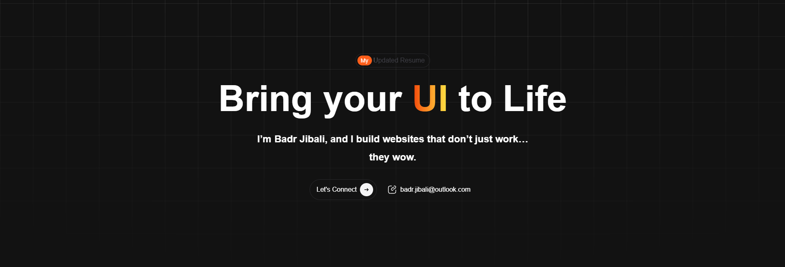

  

  
  
  

---

## 🚀 About Me

I am a **Frontend Developer** with 4+ years of experience building scalable, SEO-optimized, and high-performance web applications. I focus on clean architecture, maintainable codebases, and delivering measurable business impacts.

*   ✨ **Core Stack:** Specialized in **TypeScript**, **Vue.js (2/3)**, **Nuxt.js (SSR/SSG)**, and **React**.
*   🏗️ **Architecture:** Focused on reusable component architecture, type-safe API integration, and robust state management using tools like Pinia and Vuex.
*   ⚡ **Performance & SEO:** Expertise in Core Web Vitals, Static Site Generation (SSG), Server-Side Rendering (SSR), Hydration, and Lighthouse Optimization.
*   ⚙️ **Workflows:** Experienced in enterprise dashboards, production deployments, and CI/CD-supported workflows (GitHub Actions).

---

## 🛠️ Tech Stack

### Frontend, Styling & UI

  

  
  
  
  
  

### Desktop & Cross-Platform

  

### Build Tools, Workflows & Others

  

  
  

---

## 💼 Experience Highlights

| Company | Role & Impact | Tech Stack |
| :--- | :--- | :--- |
| **THAKAA Artificial Intelligence** | Lead frontend architecture enhancements (monorepo, modular code), architect type-safe client apps, and establish standardized component design systems. | `<Vue 3>` `<TypeScript>` `<Composition API>` |
| **PixellCode** | Developed SEO-focused applications serving high-traffic platforms, improving Lighthouse performance scores from ~70s to 90+. | `<Nuxt.js>` `<Vue 3>` `<TypeScript>` |
| **Wakeb Data** | Built enterprise-grade dashboards for data-intensive operations, optimizing complex data flows to improve UI responsiveness. | `<Vue 2/3>` `<Vuetify>` `<Pinia>` |
| **AiTech** | Developed scalable applications with a focus on performance, cross-device responsiveness, and integrated RESTful APIs. | `<Nuxt.js>` `<REST APIs>` |

---

## 📊 GitHub Stats

  
  

 

  

